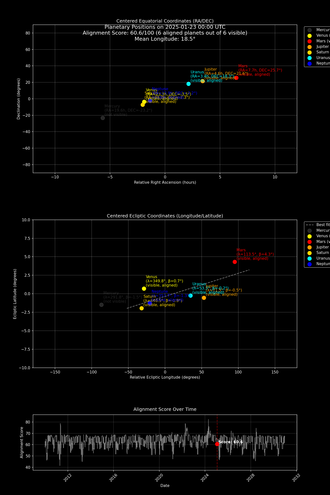

# 行星对齐可视化

[English](README.md) | 中文

这是一个用于观测和可视化行星对齐的Python项目，特别聚焦于2025年从北京视角观测的最佳行星排列时刻。

## 项目背景

行星对齐是难得一见的天文现象，指多颗行星在夜空中排列成近似直线的壮观景象。虽然行星在宇宙中的实际几何对齐极为罕见，但从地球视角观测到的视觉对齐现象依然令人惊叹，这种天文奇观自古以来就令人类着迷。

本项目主要实现：
- 定位2010-2030年最佳行星对齐时刻
- 通过赤道/黄道坐标系可视化行星排列
- 制作行星运动过程动画视频
- 提供对齐质量的量化评估指标

## 实现原理

### 核心算法

项目采用以下关键技术实现天文分析：

1. **位置计算**
   - 基于Skyfield库的高精度天文计算
   - 将日心坐标转换为北京视角的地心坐标
   - 考虑光行时和光行差等观测效应

2. **对齐评估**
   - 使用RANSAC算法寻找最佳拟合线
   - 三维评分体系：
     - 可见行星数量（40%权重）
     - 排列紧密度（距拟合线距离，30%）
     - 经度集中度（经度分散度，30%）

3. **可见性分析**
   - 计算北京昼夜时间
   - 判定行星可见时段
   - 缓存机制提升计算效率

4. **可视化呈现**
   - 双坐标系展示：
     - 赤道坐标系（赤经/赤纬）
     - 黄道坐标系（经度/纬度）
   - 生成时间维度评分曲线
   - 制作行星运动动画

### 效果示例



可视化界面包含：
- 上部：赤道坐标视图，展示行星相对于天球赤道的位置
- 中部：黄道坐标视图，显示行星在黄道面的分布及最佳拟合线
- 下部：动态评分曲线，高亮显示当前时刻对齐评分

## 环境配置

### 运行要求

需要Python 3.8或更高版本，主要依赖库：
- skyfield >= 1.46.0（天文计算）
- numpy >= 1.24.0（数值计算）
- matplotlib >= 3.8.0（可视化）
- moviepy == 1.0.3（视频生成）
- scikit-learn >= 1.3.0（RANSAC算法）
- tqdm >= 4.66.0（进度提示）

### 安装指南

1. 克隆仓库：
   ```bash
   git clone [仓库地址]
   cd [仓库目录]
   ```

2. 创建虚拟环境：
   ```bash
   python -m venv .venv
   source .venv/bin/activate  # Windows请使用：.venv\Scripts\activate
   ```

3. 安装依赖：
   ```bash
   pip install -r requirements.txt
   ```

4. 获取星历数据：
   首次运行时会自动下载JPL的DE421星历文件（约17MB）：
   - Linux/Mac：`~/.cache/skyfield/`
   - Windows：`C:\Users\<用户名>\AppData\Local\skyfield\`

   也可手动下载：
   ```
   https://naif.jpl.nasa.gov/pub/naif/generic_kernels/spk/planets/de421.bsp
   ```
   放置于项目目录即可。

### 使用说明

1. 运行主程序：
   ```bash
   python planet_alignment.py
   ```

2. 程序将自动：
   - 计算行星位置与可见性
   - 生成对齐评分
   - 在`alignment_viz`目录保存可视化结果
   - 输出行星运动视频

### 生成文件

- `alignment_viz/`：各帧图像
- `alignment_scores_cache.json`：评分缓存
- `planet_visibility_cache.jsonl`：可见性数据
- 最终合成视频

## 注意事项

- 所有计算均以北京为观测点（北纬39.9042°，东经116.4074°）
- 采用并行计算加速处理
- 内置缓存机制来避免重复计算
- 可视化包含所有行星（含不可见）以保证完整性 